# **IOWA - Des Moines Bike Sharing Business Proposal** 

## Overview of the Project :
- On any new start, past data can provide valuable insights.
- Following this note, an already existing and thriving bike ride share business - New York City Bike Sharing data was analysed.
- NYC Citibike data was analysed and visualised using Tableau. 
- The data of August 2019 from NYC citibike business was taken as source for this analysis. 
- Number of Trips, Trip Duration, Peak Hrs, User composition and such other factors were analysed.
- The complete analysis with worksheets, dashboards and Story can be found at : <a href="https://public.tableau.com/views/NYC_Citibike_RideShare/Story_NYCCitibikeAnalysis?:language=en&:retry=yes&:display_count=y&:origin=viz_share_link">------> Bike Sharing Tableau Story</a>
- Please feel free to open the tableau link, scroll through the 2 stories and filter the data as needed on the worksheets using filters.
---
## **Results :**
- Initially to understand the trip duration of bikes, below visualisation was created. Filters are provided to add the number of hrs required for analysis. Based on the below set of filters we can infer that the max number of trips are seen with tripduration of 5mins. Post this time, the number of trips declines rapidly. At 5mins duration bike trips range at 140K and by the time it reaches 22mins it falls to 40K. The fall continues to reach just 1K for trip duration of 55+ mins. Post this, number of trips never raises and stays well below 1K. Thus we can clearly infer that higher the trip duration, lesser is the number of trips. 
- 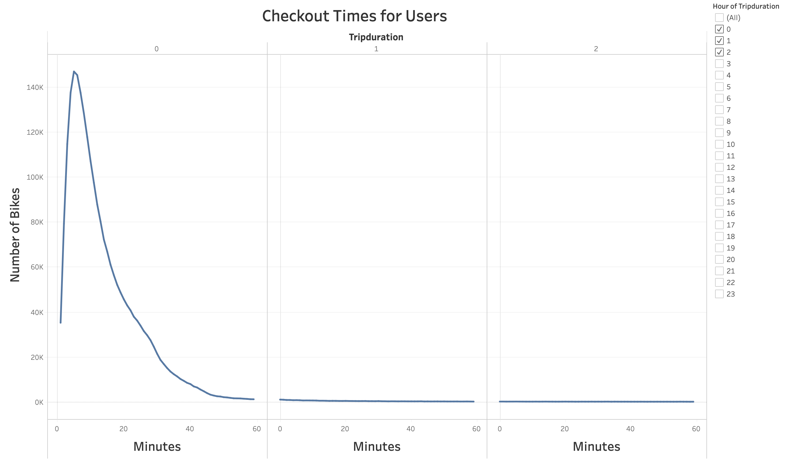</img>
- Though we got to know the busiest trip duration in mins, we still have to  figure out which part of the day is busy. So next visualisation was created to understand the peak hrs for the month of August. Can infer from the horizontal bar graph that morning times from 7AM to 10PM gets busy and evenings from 4PM to 8PM are busy hrs. 
- 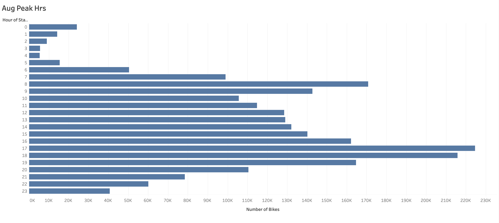</img>
- We could infer the busy times of a day but we dont have clarity if this peak time holds good on all the days of the week. Below visualisation of bike trips vs days of a week vs Hrs in a day gives clarity on this aspect. We can easily infer that on all weekdays from monday to friday morning 7AM to 10AM are busy and again evenings 4PM to 8PM are busy. This inference matches our inference from Aug Peak hrs visualisation. But on weekends - saturdays and sundays the number of trips are increasing through the day and spread across from morning 8AM to 8PM.
- 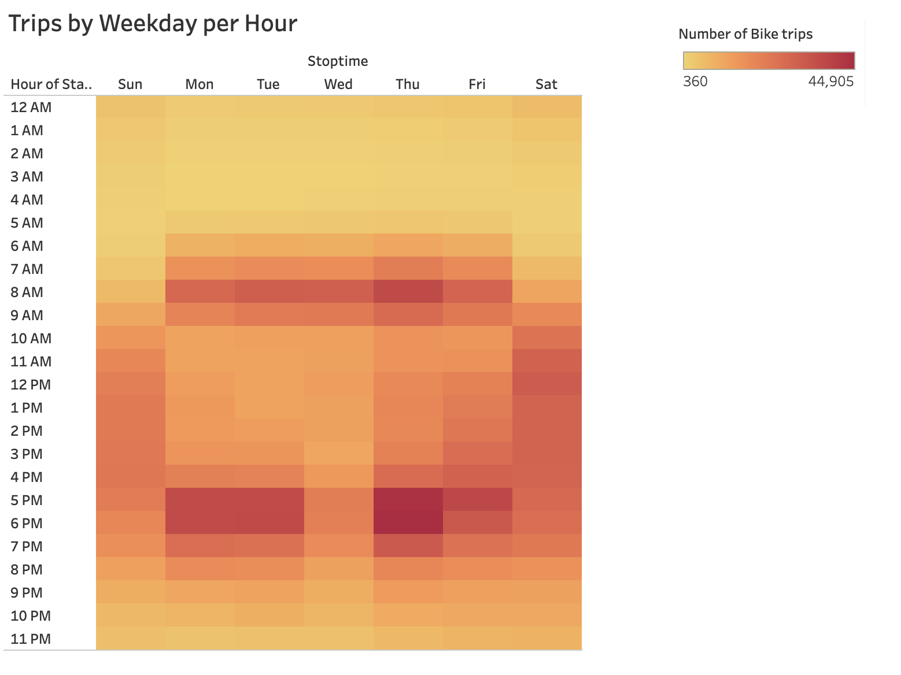</img>
- To understand the composition of bike users following visualizations were created. Firstly, pie graph with usertype distribution was plotted. This concludes that majority (80+%) of users for NYC Citibike are registered subscribers and only the rest are customers.
- 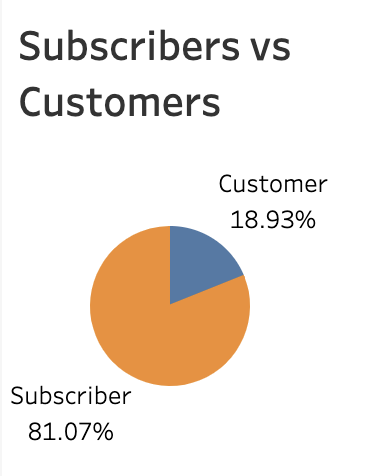</img>
- Below visualization on Gender clearly shows that Male users are around 65%, Females around 25% and rest are of Unknown gender.
- 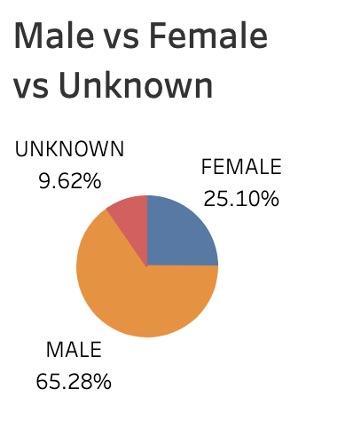</img>
- To understand the effect of Gender, on the trip duration in minutes below visualisation was created. From the graph we can infer that the max number of trips from each gender peaks at 5mins which is on similar lines with our earlier visualisation. So gender doesnt have any effect on the peak duration in minutes. For any gender, trip duration more than 55+mins, leads to very less number of trips. 
- 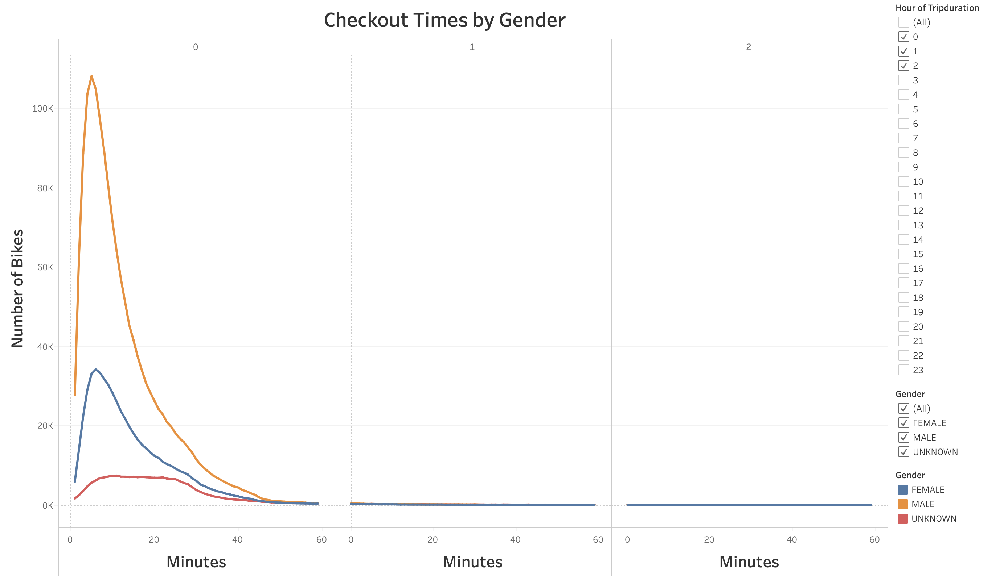</img>
- Again, to understand the effect of gender on bike trips vs days of a week vs Hrs of a day below visualisation was created. The heatmap shows that both Male and Female gender follows our earlier inference on weekdays from monday to friday morning 7AM to 10AM are busy and evenings 4PM to 8PM are busy, weekends saturdays and sundays 8AM to 8PM are busy. But the Unknown gender varies a bit as they hire bikes uniformly across all times of a day and all days of a week with only slight increases especially during weekends. 
- 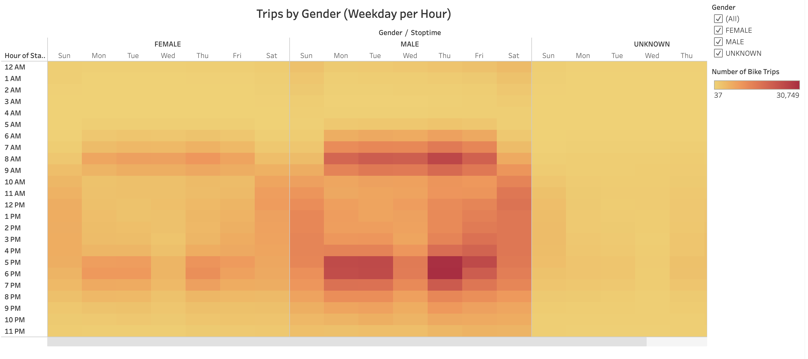</img>
- To understand the effect of usertypes on number of bike rides vs days of a week along with 3 different gender below visualisation was created. We can infer that both male and female gender registered subscribers have common trend of hiring bikes on all days of a week with peak usage on thursdays. Subscribers with unknown gender use bikes almost uniformly on all days of a week. All gender Customers seems to have similar behavior of hiring bikes uniformly across all days of the week with very very slight increase on saturday.
- 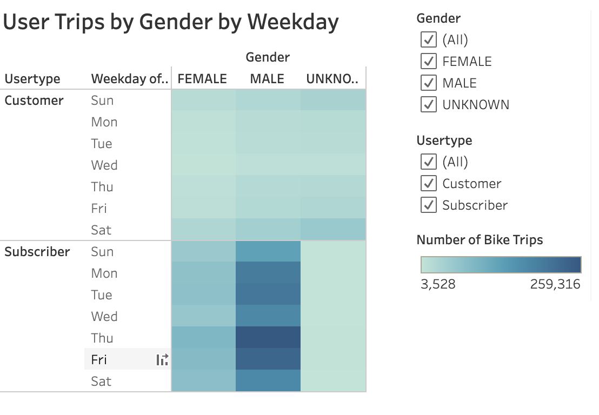</img>
## **Summary**
- With the above visualisations from an already thriving bike share business, lots of valuable insights can be obtained to the new business proposal of setting up a bike ride share business in Des Moines, IOWA.
- If the population of Des Moines area is known, we can make an attempt to predict and understand composition of the target users.
- By making an attempt to understand the target users of bike share in IOWA, if we get to understand the usertypes and gender composition of the target users we can analyse on how many bike ride share stations might be required across Des Moines and can also workout to figure out the number of bikes we might need to start the business.
- We can get some insights into the peak hrs in a day, peak days in a week and so on if we drill down more into the occupational and lifestyle similarities of target users in Des Moines when compared to New York.
- 2 additional visualizations that are suggested for future analysis would be :
    - To analyse the "Top Starting Stations vs Trip Duration Hrs" of hiring bikes. This would help in understanding the number of stations needed and to figure out the operational timings for these stations. Visualization can be as shown with filters on trip duration in Hrs. For eg. in below screenshot the top starting positions data are filtered on 8hrs trip duration. 
    - 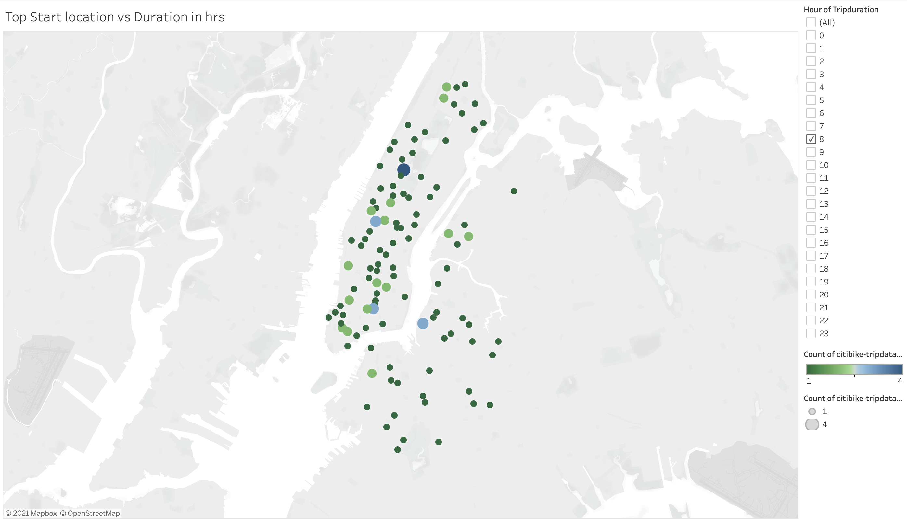</img>
    - When we are analysing starting stations, its very obvious and needed to analyse the "Top Ending Stations vs Trip Duration Hrs". Below eg. shows "Top Ending Stations" filtered on 8hrs trip duration.
    - 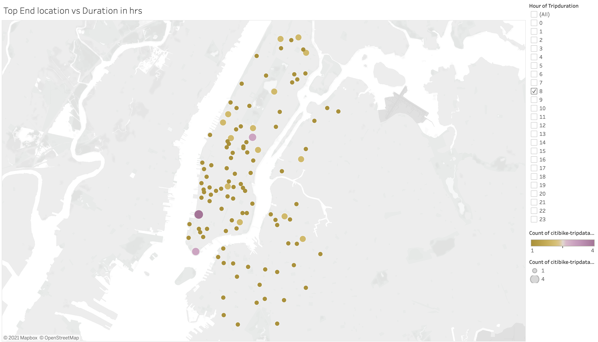</img>
    - Another visualisation that can be suggested is to get some kind of leads in understanding the parameters/indicators that can be used for maintenance of bikes. For this we need to analyse the utilization of bikes by plotting Bike ID vs number of trips. Taking it a bit forward and adding the trip duration in Hrs to it will help us in understanding the bikes used in longer trips and shorter trips separately which helps in determining the need for maintenance. In the below eg, Bike ID vs number of trips are plotted with filter on trip duration in Hrs set to 0 meaning any trip from a minute to 59mins are included in this plot. 
    - 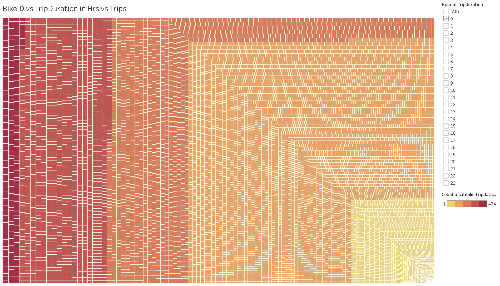</img>
    - As we have already inferred in results, as the trip duration hrs increase, number of trips decreases drastically. This inference is validated with below eg of filtering on 3hrs meaning any trip duration above 3hrs 0mins to 3hrs 59 mins are included in this plot. The same visualization can be used to filter on 23 hrs trip duration as well which means that the bikes used for long distance can be easily identified with this plot.
    - 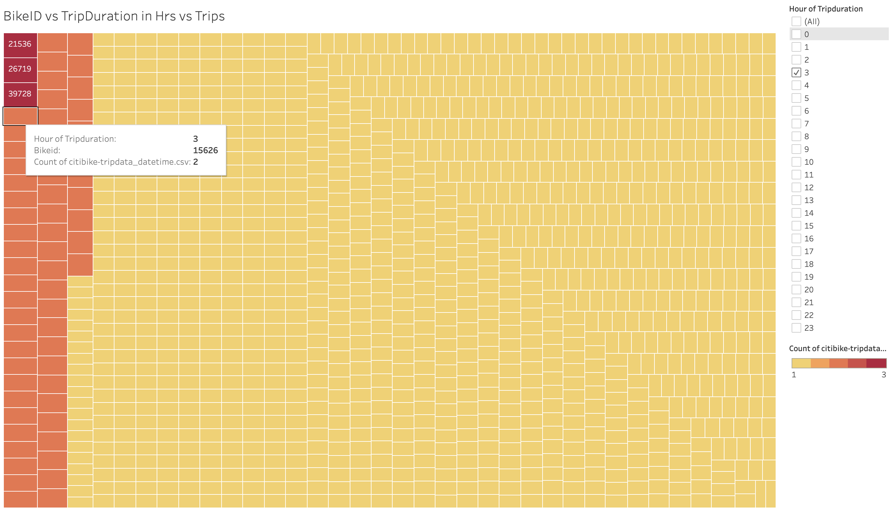</img>
    ---
    ---